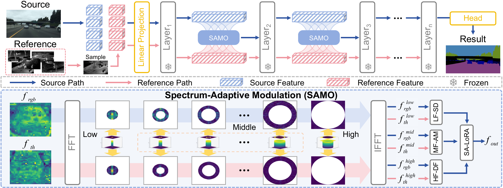

# Spectrum-Adaptive Modulation for Generalizable RGB-to-Thermal Semantic Segmentation

**Runtong Zhang<sup>1,2</sup>, Fanman Meng<sup>1,*</sup>, Zihuan Qiu<sup>1</sup>, Mingzhou He<sup>1</sup>, Xiwei Zhang<sup>1</sup>, Qingbo Wu<sup>1</sup>, Linfeng Xu<sup>1</sup>, Hongliang Li<sup>1</sup>**

- <sup>1</sup> School of Information and Communication Engineering, University of Electronic Science and Technology of China, Chengdu, China 
- <sup>2</sup> School of Information and Control Engineering, Southwest University of Science and Technology, Mianyang, China 

## Overview

[](figures/overview-v10.pdf)

[Download the overview PDF](figures/overview-v10.pdf).

Thermal imagery supports scene understanding under low illumination, fog, and smoke, but dense thermal annotations are costly, and models trained on abundant labeled RGB images face a substantial cross-spectral discrepancy when deployed on thermal imagery. We propose **Spectrum-Adaptive Modulation (SAMO)**, which uses a small auxiliary pool of unlabeled thermal references, collected independently of the deployment target datasets, to guide feature modulation during training. Within a frozen DINOv2 backbone, SAMO decomposes RGB and reference features into low-, mid-, and high-frequency bands: low-frequency semantic decoupling (LF-SD) uses a mutual-information-driven objective to retain RGB semantics while recomposing thermal domain characteristics; mid-frequency adaptive modulation (MF-AM) injects reference-guided correlated noise; and high-frequency dynamic fusion (HF-DF) incorporates complementary thermal details. Spectrum-adaptive LoRA (SA-LoRA) integrates the processed bands for efficient adaptation with a Mask2Former segmentation head. The **SAMO+** variant further introduces a source-label-anchored semantic-sufficiency objective using class prototypes. We establish the **RGB-to-Thermal Semantic Segmentation (RTSS)** benchmark with Cityscapes, BDD100K, and Mapillary as RGB sources and FMB, SCUT, and SODA as unseen thermal evaluation domains.

## Datasets

**Dataset download (Google Drive): 整理中.**

The download link and preparation instructions will be added here once the data package is ready.

| Role | Datasets |
|---|---|
| RGB sources | Cityscapes, BDD100K, Mapillary |
| Thermal evaluation domains | FMB, SCUT, SODA |
| Auxiliary thermal references | Unlabeled LLVIP thermal images, provided through the prepared IR-StyleSet directory |

## Performance and Checkpoints

All scores are mIoU (%); the average is the arithmetic mean over the three thermal evaluation domains. The following **SAMO+** results are reported in Table III of the manuscript.

| RGB source | FMB | SCUT | SODA | Average | Checkpoint filename | Download (Google Drive) |
|---|---:|---:|---:|---:|---|---|
| Cityscapes | 58.85 | 75.61 | 69.98 | 68.15 | `citys_samo_plus_68.15.pth` | 整理中 |
| BDD100K | 63.24 | 74.33 | 70.45 | 69.34 | `bdd_samo_plus_69.34.pth` | 整理中 |
| Mapillary | 63.69 | 75.45 | 72.77 | 70.64 | `map_samo_plus_70.64.pth` | 整理中 |

**Released-checkpoint reproduction:** the local evaluation records dated September 16, 2026 report the following results with the released SAMO+ v3 code and weights. These differ slightly from the manuscript results above.

| RGB source | FMB | SCUT | SODA | Average |
|---|---:|---:|---:|---:|
| Cityscapes | 58.83 | 75.65 | 70.01 | 68.16 |
| BDD100K | 63.28 | 74.50 | 70.46 | 69.41 |
| Mapillary | 63.88 | 75.36 | 72.82 | 70.69 |

**Evaluation protocol:** resize to 1024 × 512, sliding-window crop of 512 × 512, stride of 341 × 341, seed 3407, and no test-time augmentation. The project evaluator excludes classes with zero or NaN IoU when computing each domain's mIoU; these values use that evaluation convention.

The checkpoint download links will be added individually once the Google Drive uploads are ready. Place the downloaded weights under `checkpoints/`. Evaluation also requires the converted DINOv2 backbone at `checkpoints/dinov2_converted_512x512.pth`.

The scores embedded in checkpoint filenames match the manuscript averages; the reproduction table reports the averages obtained in the saved local evaluation runs.

## Citation

If you find this work useful, please cite the manuscript. Publication details will be added once available.

```bibtex
@unpublished{zhang_samo_rgb2t,
  title  = {Spectrum-Adaptive Modulation for Generalizable {RGB}-to-Thermal Semantic Segmentation},
  author = {Zhang, Runtong and Meng, Fanman and Qiu, Zihuan and He, Mingzhou and Zhang, Xiwei and Wu, Qingbo and Xu, Linfeng and Li, Hongliang},
  note   = {Manuscript},
  url    = {https://github.com/RTZhang98/SAMO-for-RGB2T}
}
```

## Acknowledgements

We thank the authors and maintainers of the following open-source projects for sharing their code and models:

- [Rein](https://github.com/w1oves/Rein), for the foundation-model adaptation codebase.
- [Mask2Former](https://github.com/facebookresearch/Mask2Former), for the segmentation architecture.
- [DINOv2](https://github.com/facebookresearch/dinov2), for the pretrained visual backbone.
- [MMSegmentation](https://github.com/open-mmlab/mmsegmentation), [MMDetection](https://github.com/open-mmlab/mmdetection), [MMEngine](https://github.com/open-mmlab/mmengine), and [MMCV](https://github.com/open-mmlab/mmcv), for the training and evaluation framework.

We also thank the creators of Cityscapes, BDD100K, Mapillary, FMB, SCUT, SODA, and LLVIP for making their datasets available to the research community.
